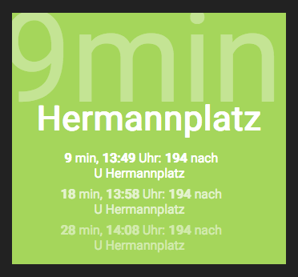

# Departures Widget

Fahrplandaten mit freundlicher Genehmigung des VBB - Ergebnisangaben ohne Gewähr

## config options:

### general options:

- api-language

### options per board:

- start (station name as you know it / as you type it in the BVG app e.g. 'S Treptower Park')
- direction (station name as you know it / as you type it in the BVG app e.g. 'S Treptower Park')
- maximum tolerated waiting time (for background color calculation)
- VBB products (e.g. SBahn, UBahn, Tram, Bus)
- title / widget display name
- amount of upcoming connections
- walk time (minutes you need to walk to the start station)
- widget_id (to be able to address multiple widgets, e.g. for different directions)

## render example

You have to supply the widget ID, configured in the `timecount.yml`. For example:

`= render 'widgets/departures',
           widget_id: 'bouchestr-to-treptowerpark'`
